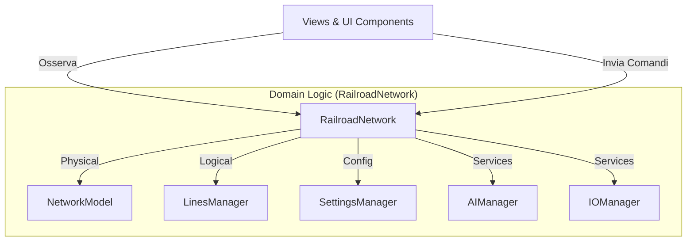

# Piano di Transizione: Separazione UI e Logica di Dominio (Pattern "Code That Fits in Your Head")

Questo documento delinea la strategia per rifattorizzare l'architettura di FdC Railway Manager, separando nettamente la Responsabilità della UI (Visualizzazione) dalla Logica di Dominio (Dati, Regole, Calcoli).

## Obiettivo
Creare un'architettura dove la UI è un mero "consumatore" di stato e inviatore di comandi, mentre tutta la logica risiede in un modello di dominio coeso e strutturato (`RailroadNetwork`).

## 1. Nuova Architettura: `RailroadNetwork` (Aggregate Root)

Il concetto chiave è l'uso di un **Aggregate Root** (`RailroadNetwork`) che incapsula sottomoduli specializzati. Questo riduce il carico cognitivo: la UI deve conoscere solo `RailroadNetwork`.

### Suddivisione delle Responsabilità (Chunking)
Seguendo il principio del "Seven plus or minus two", abbiamo diviso il dominio in 5 aree chiare:
1.  **NetworkModel**: Gestisce il grafo fisico (Nodi, Archi). Sa come calcolare percorsi, ma non sa cosa siano i treni.
2.  **LinesManager**: Gestisce il traffico (Linee, Treni, Orari). Usa il *NetworkModel* per validare i percorsi. Gestisce i conflitti.
3.  **SettingsManager**: Gestisce le configurazioni globali e i parametri fisici predefiniti.
4.  **AIManager**: Facade per i servizi di intelligenza artificiale (Cloud/Locale).
5.  **IOManager**: Gestisce import/export e persistenza.

## 2. Piano di Esecuzione

### Fase 1: Fondamenta (Completata)
- [x] Creazione della classe `RailroadNetwork.swift`.
- [x] Definizione dei sottomoduli (`NetworkModel`, `LinesManager`, ecc.).
- [x] Porting iniziale della logica da `TrainManager` e `RailwayNetwork`.

### Fase 2: Integrazione ("Strangler Fig Pattern")
Invece di riscrivere tutto in una volta, "strangoleremo" il vecchio codice sostituendolo pezzo per pezzo.

1.  **Iniezione in AppState**: Aggiungere `var railroad: RailroadNetwork` dentro `AppState`.
2.  **Parallelismo Dati**: Inizialmente, `railroad` caricherà gli stessi dati di `aiNetwork` per garantire continuità.

### Fase 3: Migrazione delle View (Refactoring)
Aggiorneremo le View una per area funzionale per puntare al nuovo modello.

- **Step 3.1: Mappa e Infrastruttura (`RailwayMapView`)**
    - Sostituire l'uso di `AppState.aiNetwork` con `AppState.railroad.network`.
    - I comandi di modifica (aggiungi nodo, sposta nodo) chiameranno `railroad.network.addNode(...)`.
    
- **Step 3.2: Treni e Orari (`SchedulerView`, `TrainDetailView`)**
    - Sostituire `TrainManager` (EnvironmentObject) con `AppState.railroad.lines`.
    - La logica di "Refresh" degli orari sarà incapsulata in `railroad.lines.refreshSchedules()`.
    
- **Step 3.3: Impostazioni e IO**
    - Centralizzare le `AppStorage` sparse in `railroad.settings`.

### Fase 4: Pulizia
- Rimuovere `TrainManager.swift` (vecchio).
- Rimuovere `RailwayNetwork` (vecchia struct/class se ridondante).
- Rimuovere `FDCSimulator` (integrato in `LinesManager`).

## 3. Regole per il "Codice che sta in testa"
1.  **La UI non calcola**: Le View non devono mai fare calcoli complessi (es. "qual è il prossimo treno?"). Chiedono al modello: `railroad.lines.getNextTrain()`.
2.  **Command/Query Separation**: 
    - Le proprietà `@Published` sono per la lettura (Query).
    - Metodi espliciti (es. `addTrain()`, `optimize()`) sono per le modifiche (Command).
3.  **Nessuno stato "orfano"**: Tutto lo stato dell'applicazione deve risiedere o discendere da `RailroadNetwork`. Niente `@State` complessi nelle View che duplicano logica di business.

---
**Prossimo Passo Operativo:**
Procedere con la **Fase 2**: Integrare `RailroadNetwork` in `AppState` e collegare la prima View (`RailwayMapView`) per verificare il funzionamento.
