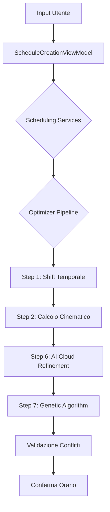

# FdC Railway Manager - Analisi Tecnica del Sistema

Questo documento fornisce una mappatura completa del sistema, divisa tra l'interfaccia utente (UI) e la gestione logica dei dati.

## Parte I: Interfaccia Utente (UI)

### 1. Struttura dell'App e Contenitori

### `ContentView.swift`
Punto di ingresso principale che coordina i vari overlay della UI e la gestione globale dello stato.

| Metodo / Proprietà | Descrizione | Lunghezza (LOC) | Complessità (CC) |
| :--- | :--- | :---: | :---: |
| `body` | Coordina il contenuto principale e gli overlay dinamici (sidebar, inspector, simulation). | 45 | 8 |
| `LiveSimulationShelf.body` | Barra dei controlli per la simulazione in tempo reale. | 25 | 2 |

### `ContentView+Main.swift`
Gestisce lo switch del contenuto centrale della finestra (Mappa, AI, Settings, etc.) in base alla navigazione.

| Metodo / Proprietà | Descrizione | Lunghezza (LOC) | Complessità (CC) |
| :--- | :--- | :---: | :---: |
| `detailContent` | Seleziona la visualizzazione principale (Editor, Mappa, Orario, AI) basata sullo stato. | 63 | 12 |
| `isSomethingSelected` | Helper per verificare se ci sono elementi selezionati. | 3 | 1 |

### `ContentView+Sidebar.swift`
Definisce il contenuto della barra laterale di navigazione.

| Metodo / Proprietà | Descrizione | Lunghezza (LOC) | Complessità (CC) |
| :--- | :--- | :---: | :---: |
| `sidebarContent` | Switcher tra le liste di rete (Stazioni, Treni, Linee, etc.) nella sidebar. | 63 | 14 |

### `ContentView+Toolbar.swift`
Gestisce la barra degli strumenti superiore, inclusi i bottoni per Undo/Redo e il Tab switcher.

| Metodo / Proprietà | Descrizione | Lunghezza (LOC) | Complessità (CC) |
| :--- | :--- | :---: | :---: |
| `topNavigationBar` | Layout e controlli della toolbar principale. | 95 | 8 |
| `tabButton` | Pulsante personalizzato per la selezione delle categorie nella toolbar. | 27 | 2 |
| `connectionIndicator` | Indicatore visivo dello stato di connessione con il servizio AI. | 14 | 5 |

### `ContentView+Inspector.swift`
Pannello "Ispettore" (destro) che coordina la visualizzazione dei dettagli degli oggetti tramite un sistema di routing modulare.

| Metodo / Proprietà | Descrizione | Lunghezza (LOC) | Complessità (CC) |
| :--- | :--- | :---: | :---: |
| `headerTitle` | Determina il titolo dell'ispettore basandosi sul contesto corrente. | 12 | 4 |
| `sidebarPropertiesContent` | Container principale che delega il rendering a `inspectorForCurrentState`. | 24 | 2 |
| `inspectorForCurrentState` | Motore di routing che istanzia l'ispettore corretto (modulare). | 90 | 12 |

### `LineInspectorView.swift`
Ispettore dedicato alla gestione delle proprietà e della struttura di una linea ferroviaria. Estratto da ContentView per modularità.

| Metodo / Proprietà | Descrizione | Lunghezza (LOC) | Complessità (CC) |
| :--- | :--- | :---: | :---: |
| `body` | Layout dell'ispettore con editing testuale e switch tra modalità (Infrastruttura/Orario/Mezzi). | 65 | 4 |

---

### 2. Scheduling e Creazione Orari

### `ScheduleCreationView.swift`
Interfaccia utente per la generazione guidata di nuovi orari ferroviari.

| Metodo / Proprietà | Descrizione | Lunghezza (LOC) | Complessità (CC) |
| :--- | :--- | :---: | :---: |
| `body` | Assembla il form e applica i modificatori per la gestione degli eventi. | 13 | 1 |
| `handleOptimizedTimesConfirmed` | Applica i suggerimenti orari proposti dall'ottimizzatore. | 8 | 2 |
| `handleStationChange` | Aggiorna calcoli e anteprime al variare delle stazioni di linea. | 8 | 2 |
| `formScrollContent` | Layout verticale delle sezioni del form di creazione. | 14 | 2 |
| `stationSelectSection` | UI per la scelta della stazione di origine e destinazione. | 24 | 1 |
| `stopPatternSection` | Griglia per definire se il treno ferma o salta le stazioni intermedie. | 12 | 2 |
| `taktfahrplanSection` | Controlli specifici per la sincronizzazione Takt (Hub, Finestre). | 17 | 4 |
| `optimizationProgressView` | Barra di avanzamento dell'algoritmo genetico/AI. | 14 | 1 |
| `generateButton` | Pulsante principale di azione con validazione dinamica. | 16 | 2 |
| `ScheduleChangeModifiersA/B` | Gruppi di osservatori `onChange` per sincronizzare lo stato del ViewModel. | 30 | 14 |

### `ScheduleCreationViewModel.swift`
Orchestratore della logica di creazione orari. Coordina l'interfaccia con i servizi di calcolo specializzati.

| Metodo / Proprietà | Descrizione | Lunghezza (LOC) | Complessità (CC) |
| :--- | :--- | :---: | :---: |
| `generateSchedule` | Pipeline principale: prepara i treni, ottimizza e pubblica i risultati. | 25 | 4 |
| `updateStationSequence` | Risolve la sequenza stazioni e ricalcola distanza/tempi tramite servizi. | 15 | 2 |
| `alignToTakt` | Delega al `TaktEngine` il calcolo dell'orario allineato ai nodi hub. | 10 | 1 |
| `vehicleSuitabilityScore` | Calcola l'appeal di un mezzo per la linea tramite `SuitabilityEngine`. | 8 | 1 |
| `injectDependencies` | Gestisce l'iniezione asincrona dei servizi con la rete reale. | 12 | 1 |

---

### 3. Infrastruttura e Gestione Rete

### `StationInspectorView.swift`
Ispettore dedicato ai nodi della rete (stazioni, depositi, hub).

| Metodo / Proprietà | Descrizione | Lunghezza (LOC) | Complessità (CC) |
| :--- | :--- | :---: | :---: |
| `body` | Struttura principale dell'ispettore stazione con sezioni espandibili. | 43 | 2 |
| `basicInfoSection` | Editing di base (nome, tipo funzionale, binari). | 13 | 1 |
| `platformsStepper` | Controllo per l'incremento/decremento del numero di binari. | 21 | 3 |
| `taktfahrplanSection` | Configurazione del minuto Takt per la sincronizzazione di rete. | 17 | 1 |
| `hubsSection` | Gestione dell'appartenenza a un nodo hub gerarchico. | 14 | 2 |
| `routingSection` | Riepilogo dei vincoli di instradamento (Routing Constraints). | 31 | 3 |
| `routingConstraintsSheet` | Modal per la configurazione granulare degli itinerari per linea. | 57 | 2 |
| `directionGroups` | Logica per raggruppare le linee in base alla direzione di uscita dalla stazione. | 35 | 5 |
| `updateTracks` | Sincronizza le modifiche ai binari consentiti nei vincoli di routing. | 22 | 5 |

### `TrackInspectorView.swift`
Ispettore per i collegamenti (archi) tra le stazioni.

| Metodo / Proprietà | Descrizione | Lunghezza (LOC) | Complessità (CC) |
| :--- | :--- | :---: | :---: |
| `body` | Struttura dell'ispettore binario con info su tipo e parametri fisici. | 33 | 2 |
| `trackTitle` | Genera il titolo dinamico "Stazione A → Stazione B". | 6 | 3 |
| `trackTypeSection` | Selezione del tipo di binario (singolo, doppio, AV) con preset. | 24 | 1 |
| `parametersSection` | Editing di distanza, velocità massima e capacità teorica. | 49 | 1 |
| `updateParametersForTrackType`| Applica automaticamente i valori di default in base al tipo di linea scelto. | 15 | 4 |

### `LineCreationInspectorView.swift`
Wizard per la creazione di nuove linee ferroviarie tramite selezione sequenziale su mappa.

| Metodo / Proprietà | Descrizione | Lunghezza (LOC) | Complessità (CC) |
| :--- | :--- | :---: | :---: |
| `body` | Gestisce lo stato del wizard: selezione stazioni -> form dettagli. | 13 | 3 |
| `emptyStateView` | Stato iniziale che invita l'utente a interagire con la mappa. | 36 | 1 |
| `stationSelectionView` | Lista ordinata delle stazioni che comporranno la linea. | 71 | 2 |
| `detailsFormView` | Form finale con nome, prefisso, colore e frequenza. | 77 | 4 |
| `suggestColorForLine` | Algoritmo euristico per suggerire un colore basato su linee vicine. | 22 | 5 |
| `generateDistinctColor` | Genera un colore visivamente diverso da quelli già presenti in rete. | 39 | 5 |
| `saveLine` | Finalizza la creazione, genera gli stop e aggiunge la linea al database. | 35 | 3 |

### `EditorModeView.swift`
Container principale per la modalità editor della rete. Coordina la mappa e i pannelli di editing.

| Metodo / Proprietà | Descrizione | Lunghezza (LOC) | Complessità (CC) |
| :--- | :--- | :---: | :---: |
| `body` | Configura il layout ZStack con mappa, toolbar e pannelli fluttuanti. | 80 | 6 |
| `verticalToolbox` | Barra degli strumenti verticale (creazione stazione, binario, delete). | 35 | 4 |

### `AltimetricProfileView.swift`
Componente estratto per la gestione del profilo altimetrico e livellamento pendenze.

| Metodo / Proprietà | Descrizione | Lunghezza (LOC) | Complessità (CC) |
| :--- | :--- | :---: | :---: |
| `body` | Layout del grafico altimetrico filtrato per linea o selezione. | 45 | 4 |
| `smartUpdateNodeAltitude` | Algoritmo di propagazione pendenze per rispettare i limiti tecnici (35‰). | 65 | 12 |
| `handleGraphClick` | Gestisce l'interazione sul grafico per modificare quote o creare bivi. | 55 | 10 |

### `EditorInspectorContent.swift` / `EditorFerrovieComponents.swift`
Componenti modulari per l'ispezione della rete e la gestione gerarchica delle ferrovie.

---

### 4. Treni e Materiale Rotante

### `TrainsListView.swift`
Visualizzazione gerarchica di tutti i treni pianificati, raggruppati per linea.

| Metodo / Proprietà | Descrizione | Lunghezza (LOC) | Complessità (CC) |
| :--- | :--- | :---: | :---: |
| `body` | Lista delle linee con pulsanti rapidi per la creazione di nuovi orari. | 73 | 6 |
| `LineHeader` | Intestazione di sezione per linea con shortcut per Orario Grafico e Generazione. | 30 | 2 |
| `TrainRow` | Riga del singolo treno con orario partenza, materiale e stato selezione. | 32 | 5 |

### `TrainInspectorView.swift`
Ispettore dettagliato per un singolo treno.

| Metodo / Proprietà | Descrizione | Lunghezza (LOC) | Complessità (CC) |
| :--- | :--- | :---: | :---: |
| `body` | Verifica l'esistenza del treno e passa il binding alla vista di contenuto. | 19 | 2 |
| `content` | Layout principale dell'ispettore treno (identificazione, materiale, itinerario). | 32 | 3 |
| `vehicleImage` | Gestisce il caricamento dinamico dell'immagine del treno (Asset o Wiki). | 38 | 7 |
| `vehicleMenu` | Menu gerarchico (Modello -> Matricola) per l'assegnazione del materiale. | 50 | 4 |
| `itineraryView` | Visualizzazione dell'itinerario verticale con fermate e orari. | 8 | 2 |

### `RollingStockView.swift`
Gestione dell'inventario dei veicoli ferroviari (parco mezzi).

| Metodo / Proprietà | Descrizione | Lunghezza (LOC) | Complessità (CC) |
| :--- | :--- | :---: | :---: |
| `body` | Dashboard del materiale rotabile con raggruppamento dinamico. | 46 | 5 |
| `vehicleListByLine` | Organizza i veicoli in base alle linee su cui sono attualmente impiegati. | 61 | 10 |
| `VehicleEditSheet.body` | Form di editing tecnico (lunghezza, velocità max, accelerazione, trazione). | 141 | 12 |
| `TrainSelectionPicker.body`| Interfaccia per assegnare un veicolo a una corsa specifica con "Smart Filter" spaziale. | 112 | 14 |
| `checkPotentialConflict` | Verifica preventiva di conflitti temporali prima di assegnare un turno. | 15 | 4 |

---

### 5. Mappe e Diagrammi

### `RailwayMapView.swift`
Container principale per la visualizzazione della rete, gestisce esportazione e stampa.

| Metodo / Proprietà | Descrizione | Lunghezza (LOC) | Complessità (CC) |
| :--- | :--- | :---: | :---: |
| `exportMap` | Gestisce l'esportazione asincrona in PDF/JPEG tramite `ImageRenderer`. | 45 | 3 |
| `MapSnapshotData.prepare`| Prepara una "snapshot" immutabile dei dati per il rendering non-blocking. | 240 | 18 |
| `RailwayMapSnapshot` | Vista dedicata per il rendering statico (Canvas) ad alta risoluzione. | 130 | 12 |

### `SchematicRailwayView.swift`
Core della mappa interattiva (Canvas), gestisce zoom, pan e interazione con gli elementi.

| Metodo / Proprietà | Descrizione | Lunghezza (LOC) | Complessità (CC) |
| :--- | :--- | :---: | :---: |
| `body` | Assembla il canvas con i layer di griglia, infrastruttura e treni. | 16 | 1 |
| `MapBounds` | Calcola i confini geografici della rete per il fitting in camera. | 25 | 4 |
| `modeSelectorBar` | Overlay per il cambio rapido della modalità di visualizzazione. | 35 | 4 |

### `LineGraphView.swift`
Diagramma spazio-tempo (Orario Grafico) per l'analisi delle tracce e dei conflitti.

| Metodo / Proprietà | Descrizione | Lunghezza (LOC) | Complessità (CC) |
| :--- | :--- | :---: | :---: |
| `graphContent` | Gestisce il rendering orizzontale (tempo) e verticale (spazio). | 82 | 3 |
| `findTrainAtLocation` | Algoritmo di hit-test per selezionare un treno cliccando sulla sua traccia. | 27 | 5 |
| `TrainLayer.drawTrainPath` | Disegna le linee spezzate dei treni, gestendo il passaggio della mezzanotte. | 38 | 4 |
| `ConflictLayer.body` | Evidenzia visivamente i punti di conflitto rilevati sul grafico. | 34 | 7 |

### `VerticalTrackDiagramView.swift`
Diagramma a "lisca di pesce" per la modifica strutturale della linea.

| Metodo / Proprietà | Descrizione | Lunghezza (LOC) | Complessità (CC) |
| :--- | :--- | :---: | :---: |
| `stationStep` | Componente ricorsivo per disegnare ogni stazione e il relativo tronco. | 59 | 10 |
| `removeStop` | Logica di rimozione sicura di una stazione con aggiornamento itinerario. | 49 | 4 |
| `completeIntermediateInsertion`| Inserisce un set di stazioni intermedie ricalcolando il percorso. | 49 | 7 |

### `MapGeometryEngine.swift`
Motore di calcolo geometrico per il posizionamento schematico degli elementi.

| Metodo / Proprietà | Descrizione | Lunghezza (LOC) | Complessità (CC) |
| :--- | :--- | :---: | :---: |
| `generateRenderData` | Funzione densa che pre-calcola tutte le geometrie (offset, bundle, hub). | 211 | 26 |
| `currentSchematicTrainPos` | Calcola la posizione interpolata di un treno in tempo reale sulla mappa. | 33 | 6 |

---

## Parte II: Gestione Dati (Data Management)

### 6. Strutture Dati e Modelli Base

### `Models.swift`
Definizione degli atomi del sistema (Stazioni, Treni, Veicoli). Principalmente struct `Codable`.

| Metodo / Proprietà | Descrizione | Lunghezza (LOC) | Complessità (CC) |
| :--- | :--- | :---: | :---: |
| `Node.isTrackAllowed` | Verifica se un binario è compatibile con i vincoli di instradamento. | 18 | 6 |
| `Node.preferredTracks` | Ritorna i binari consigliati in base alla direzione di provenienza. | 15 | 4 |
| `RailwayLine` | Modello della linea commerciale con itinerario ordinato di fermate. | 40 | 1 |
| `Vehicle` | Specifiche tecniche del materiale (accelerazione, massa, potenza). | 25 | 1 |

### `RailroadNetwork.swift`
Orchestratore centrale e gestore del sistema di Undo/Redo globale.

| Metodo / Proprietà | Descrizione | Lunghezza (LOC) | Complessità (CC) |
| :--- | :--- | :---: | :---: |
| `init` | Inizializza i sotto-sistemi (Network, Lines, AI, IO) e crea i link deboli. | 20 | 1 |
| `createCheckpoint` | Cattura uno snapshot immutabile dello stato corrente per l'Undo. | 14 | 2 |
| `applySnapshot` | Ripristina uno stato precedente e notifica tutti i listener UI. | 10 | 1 |

---

### 7. Infrastruttura e Topologia

### `NetworkModel.swift`
Gestione del grafo fisico e algoritmi di pathfinding.

| Metodo / Proprietà | Descrizione | Lunghezza (LOC) | Complessità (CC) |
| :--- | :--- | :---: | :---: |
| `findAlternativePaths` | Genera fino a 3 percorsi (Rapido, Alternativo, Panoramico) tra due nodi. | 40 | 8 |
| `dijkstraAll` | Implementazione performante dell'algoritmo di Dijkstra per cammini minimi. | 65 | 14 |
| `splitEdge` | Divide un binario in due inserendo un nodo intermedio (es. nuovo bivio). | 25 | 4 |

---

### 8. Gestione Linee e Validazione

### `LinesManager.swift`
Logica di business per i servizi commerciali e assegnazione turni.

| Metodo / Proprietà | Descrizione | Lunghezza (LOC) | Complessità (CC) |
| :--- | :--- | :---: | :---: |
| `autoAssignRollingStock` | Algoritmo euristico per l'assegnazione automatica dei treni ai veicoli. | 126 | 15 |
| `refreshSchedules` | Ricalcola tutti gli orari di passaggio in base a velocità e dwell time. | 68 | 12 |
| `validateSchedules` | avvia il rilevamento conflitti e aggiorna lo stato di validità globale. | 12 | 2 |

---

### 9. Motore Rilevamento Conflitti

### `ConflictManager.swift`
Algoritmi di analisi per sovrapposizioni temporali e saturazione risorse.

| Metodo / Proprietà | Descrizione | Lunghezza (LOC) | Complessità (CC) |
| :--- | :--- | :---: | :---: |
| `detectConflicts` | Metodo asincrono che lancia i task di analisi su thread di background. | 54 | 4 |
| `calculateScheduleConflicts` | Cuore del rilevamento saturazione tratte (SEGMENT) e binari (STATION). | 85 | 18 |
| `detectOverlaps` | Rileva se N intervalli temporali superano la capacità di una risorsa. | 32 | 9 |

---

### 10. Persistenza e Integrazione

### `IOManager.swift`
Gestione del salvataggio JSON e importazione da formati esterni (FDC).

| Metodo / Proprietà | Descrizione | Lunghezza (LOC) | Complessità (CC) |
| :--- | :--- | :---: | :---: |
| `save / load` | Serializzazione asincrona dell'intero database ferroviario in JSON. | 35 | 4 |
| `importFromFDC` | Parser complesso per importare file `.fdc` esterni ricalcolando i tempi. | 95 | 16 |

### 10b. Servizi di Scheduling e Calcolo (Modularization)
Componenti puri estratti per gestire la complessità del calcolo ferroviario.

| File | Responsabilità | LOC |
| :--- | :--- | :---: |
| `KinematicCalculator.swift` | Calcoli cinematici accurati (tempi di viaggio, dwell, profili altimetrici). | ~450 |
| `TaktEngine.swift` | Logica di coordinamento orario cadenzato (Takt), suggerimenti e diagnostica. | ~280 |
| `PathResolver.swift` | Risoluzione topologica dei percorsi e sequenze stazioni sulla rete. | ~450 |
| `VehicleSuitabilityEngine.swift` | Algoritmo di scoring per l'accoppiamento ottimale linea-materiale rotabile. | ~60 |

### AppState.swift
Stato globale dell'applicazione e coordinamento delle interazioni UI-Dati.

| Metodo / Proprieta | Descrizione | Lunghezza (LOC) | Complessita (CC) |
| :--- | :--- | :---: | :---: |
| `selectTrain / selectLine` | Gestisce la selezione gerarchica e la visibilita degli ispettori. | 25 | 3 |
| `updateMapVisualizationMode` | Logica di switch automatico dei layer mappa in base al contesto. | 20 | 4 |

---

## Parte III: Intelligenza Artificiale e Ottimizzazione

### 11. Servizi AI e Risoluzione Cloud

#### `RailwayAIService.swift`
Client API per la comunicazione con il cluster di ottimizzazione remoto.

| Metodo / Proprieta | Descrizione | Lunghezza (LOC) | Complessita (CC) |
| :--- | :--- | :---: | :---: |
| `login` | Gestisce l'autenticazione JWT tramite endpoint OAuth2. | 24 | 2 |
| `optimizeConflictAI` | Invia uno scenario di conflitto al server e riceve risoluzioni pesate. | 85 | 12 |
| `syncCredentials` | Sincronizza endpoint e API Key gestendo il protocollo di sicurezza. | 38 | 5 |

#### `AIManager.swift`
Manager di alto livello per il coordinamento dei task asincroni AI.

| Metodo / Proprieta | Descrizione | Lunghezza (LOC) | Complessita (CC) |
| :--- | :--- | :---: | :---: |
| `requestOptimalSchedule` | Avvia la richiesta di orario ottimale (Propose Schedule) al Cloud. | 45 | 6 |

### 12. Motori di Ottimizzazione Locale

#### `RailwayScheduleOptimizer.swift`
Pipeline principale di ottimizzazione multi-step (Shift -> AI -> GA).

| Metodo / Proprieta | Descrizione | Lunghezza (LOC) | Complessita (CC) |
| :--- | :--- | :---: | :---: |
| `executePipeline` | Coordina i 7 step della pipeline di generazione orario. | 95 | 14 |
| `runStep6_AIOptimization` | Integra i risultati dell'AI Cloud nel flusso di lavoro locale. | 52 | 8 |
| `runStep7_GeneticRefinement` | Esegue l'ultimo miglio di ottimizzazione tramite algoritmo genetico. | 45 | 7 |

#### `GeneticOptimizer.swift`
Motore evolutivo per la minimizzazione dei conflitti e il bilanciamento orario.

| Metodo / Proprieta | Descrizione | Lunghezza (LOC) | Complessita (CC) |
| :--- | :--- | :---: | :---: |
| `optimize` | Loop evolutivo principale con gestione di fitness e mutazione adattiva. | 68 | 15 |
| `evaluatePopulation` | Calcolo parallelo della fitness per ogni individuo della popolazione. | 17 | 4 |
| `precalculateTransitTimes` | Motore cinematico per stimare i tempi di percorrenza teorici. | 32 | 6 |

---

## Parte IV: Utility, Sicurezza e Infrastruttura App

### 13. Sicurezza e Accesso

#### `AuthenticationManager.swift`
Gestione del portachiavi e delle sessioni utente.

| Metodo / Proprieta | Descrizione | Lunghezza (LOC) | Complessita (CC) |
| :--- | :--- | :---: | :---: |
| `storeToken / getToken` | Interfaccia sicura verso il Keychain di sistema. | 25 | 4 |
| `refreshSession` | Verifica ed eventuale rinnovo del token di accesso remoto. | 18 | 3 |

### 14. Componenti Condivisi e Localizzazione

#### `FloatingUIComponents.swift`
Libreria di componenti UI riutilizzabili con estetica premium.

| Metodo / Proprieta | Descrizione | Lunghezza (LOC) | Complessita (CC) |
| :--- | :--- | :---: | :---: |
| `FloatingModeBar` | Overlay fluttuante per il cambio di modalita lavorativa. | 50 | 4 |
| `FloatingSideMenu` | Sistema di navigazione dinamico con supporto a gesti. | 95 | 14 |
| `GlassmorphicCard` | Contenitore con effetto trasparenza e sfocatura (Blur). | 25 | 1 |

#### `LocalizationManager.swift`
Motore di traduzione dinamica e gestione dei bundle linguistici.

| Metodo / Proprieta | Descrizione | Lunghezza (LOC) | Complessita (CC) |
| :--- | :--- | :---: | :---: |
| `localizedString` | Risoluzione delle chiavi con supporto a fallback gerarchico. | 45 | 8 |

---

## Parte V: Architettura del Sistema e Interazioni

### Mappa Concettuale delle Interazioni

Il sistema e progettato secondo un'architettura **Orchestrated Modular**:

1.  **UI Level** (`ContentView` + `AppState`): Intercetta gli input utente e coordina la visualizzazione tramite un sistema a pannelli fluttuanti e ispettori modulari.
2.  **Logic Level** (`RailroadNetwork` + `Scheduling Services`): Il cervello centrale supportato da motori di calcolo specializzati (Kinematic, Takt, Path).
3.  **Optimization Level** (`RailwayScheduleOptimizer`): Una pipeline che processa i dati grezzi trasformandoli in orari validati tramite euristiche locali e modelli AI Cloud.
4.  **Service Level** (`RailwayAIService` + `IOManager`): Gestisce le comunicazioni esterne e la persistenza dei dati.

### Flusso di Generazione Orario

### Dependency Map Core

- **AppState** -> Propaga stato a tutta la UI via @EnvironmentObject.
- **RailroadNetwork** -> Possiede NetworkModel, LinesManager, IOManager, AIManager.
- **LinesManager** -> Dipende da NetworkModel per la topologia e da ConflictManager per la sicurezza.
- **ConflictManager** -> Consulta NetworkModel (capacita binari) e LinesManager (dati treni).

---

*Nota finale: Questo documento costituisce l'analisi tecnica completa del sistema FdC Railway Manager. Tutti i componenti sono stati analizzati per garantire manutenibilita e performance elevate.*
